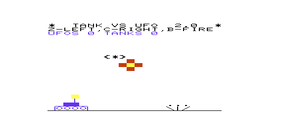
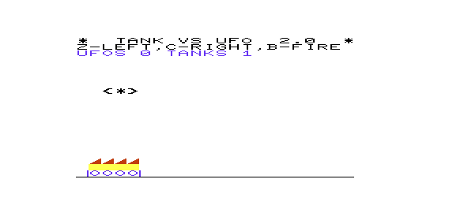

# Tank vs UFO 2.0 (Commodore VIC-20)


|||
|:---:|:---:|
|||

**Tank vs UFO 2.0** is a 6502 assembly rewrite of the 1981 **BASIC** type-in game *Tank-v-UFO* by Duane Later, from the **Commodore VIC-20** User's Manual. The original's gameplay is preserved — one strafing UFO at a time dropping aimed bombs, a tank trundling along the ground line, endless play with a UFOS/TANKS kill tally — but the engine underneath is brand new: every game event is a non-blocking state machine stepped from a single 60 Hz frame loop, so the game never freezes the way the interpreted **BASIC** original did.

- Faithful gameplay: one UFO at a time, aimed bombs, endless play and score chase — no win condition, just like every published edition of the original.
- Non-blocking engine: the tank stays under player control while a UFO explodes, UFOs keep strafing while the tank burns, and bullet-vs-bomb intercepts never pause play.
- Animated, heat-graded effects: 3-frame air explosions, ground puffs where bombs miss, and alternating flame glyphs with red tips over a yellow base.
- Runs on a stock **unexpanded** **VIC-20** — a single PRG loading at `$1001`, started with a plain `RUN`.
- Ships as a bare `.prg`, a bootable `.d64` disk image, and a `.tap` Datasette tape image.

> ***See also:** [**Tank vs UAP**](https://github.com/rohingosling/tank-vs-uap) — An extended arcade-style reimagining of the same 1981 original, also for the **Commodore VIC-20**.*

## 📑 Contents

- [🔎 Overview](#-overview)
- [🚀 Quick Start](#-quick-start)
- [🎮 Controls](#-controls)
- [🕒 History](#-history)
- [📂 Project Structure](#-project-structure)
- [💻 Building From Source](#-building-from-source)
- [🙋‍♂️ Acknowledgements](#-acknowledgements)
- [📄 License](#-license)

## 🔎 Overview

A lone UFO strafes back and forth across the sky (character rows 4–16), dropping bombs aimed at your tank. You drive left and right along the ground line and fire straight up. Shoot the UFO and it explodes in the air, then crash-dives diagonally into the ground and burns. Get hit and your tank burns instead — then a fresh tank rolls in and the duel continues. There is no end and no win condition: just the UFOS vs TANKS tally, exactly as Duane Later wrote it in 1981.

The rewrite targets a stock unexpanded **Commodore VIC-20** (~3.5 KiB of free RAM), PAL pacing, with NTSC also supported by the jiffy-clock timebase. The whole game is one PRG — no expansion RAM, no overlays, no custom IRQ; the KERNAL interrupt keeps running and supplies both the 60 Hz frame timebase and the current-key input, matching the original's `PEEK(197)` semantics.

### Features

Deliberate improvements over the 1981 original:

| # | Change |
|---|--------|
| 1 | **Non-blocking events.** The original ran every explosion, crash dive, and fire as a blocking **BASIC** subroutine, freezing the whole game. Here every entity is a state machine stepped from a single 60 Hz frame loop. |
| 2 | While the tank is burning, UFOs keep flying but drop no bombs until the new tank spawns. |
| 3 | Tank bullets only collide with a UFO that is still flying — exploding and crash-diving UFOs ignore bullets. |
| 4 | A hit UFO begins its crash dive immediately while the air explosion animates independently at the point of bullet contact. |
| 5 | **Animated effects** at 150 ms per frame: a 3-frame heat-graded air explosion, a 3-frame ground puff where bombs miss, and heat-graded burning-tank fire. |
| 6 | **Colour changes:** fire purple → red, score text yellow → blue, tank yellow → blue, air explosion black → red/yellow, muzzle flash purple → yellow. |
| 7 | The lowest UFO strafing altitude is raised one character row (flight rows 4–16). |
| 8 | **Symmetric tank travel:** the column clamp is 0–16, where the original left the rightmost column unreachable. |
| 9 | **Q quits at any time** — a stub in the cassette buffer wipes the game's RAM and resets cleanly to **BASIC**. |
| 10 | Event durations retuned: tank burn 1.0 s, ground fire 1.0 s, shot fade 0.5 s, air explosion 3 × 150 ms — each sound fade spans its event exactly. |

Original-edition bugs fixed (bugs, not behaviour):

- The score reprint no longer eats the ground line.
- A bullet hitting a bomb no longer destroys the tank (the original's `PEEK` collision sent any non-space cell to the tank-hit routine) — the bullet and bomb now annihilate each other and play continues.
- Explosion and crash-dive cell writes are clamped to the screen edges (the original's address arithmetic wrapped across rows).

## 🚀 Quick Start

Want to just play **Tank vs UFO 2.0**? Download what you need from the v2.0 release:

| File | Download | Use case |
|------|----------|----------|
| `tank-vs-ufo-2.prg` | [download](https://github.com/rohingosling/tank-vs-ufo-2.0/releases/download/v2.0/tank-vs-ufo-2.prg) | Run on **VICE**, or load on a real **VIC-20** via **SD2IEC** / 1541 |
| `tank-vs-ufo-2.d64` | [download](https://github.com/rohingosling/tank-vs-ufo-2.0/releases/download/v2.0/tank-vs-ufo-2.d64) | Bootable 1541 disk image |
| `tank-vs-ufo-2.tap` | [download](https://github.com/rohingosling/tank-vs-ufo-2.0/releases/download/v2.0/tank-vs-ufo-2.tap) | Load on a real **VIC-20** via **TAPuino**, or record onto a cassette |

### Run on VICE

```bash
xvic -memory none -autostart tank-vs-ufo-2.d64
```

The `-memory none` flag is required. **VICE** defaults to a 3 KiB RAM expansion, which moves the **BASIC** program area and silently breaks the `$1001` PRG load — the game targets a stock unexpanded **VIC-20**. If you configure **VICE** through the GUI instead, set the RAM expansion to **none** before launching.

### Run on real hardware

| Loading device | File | Load command |
|----------------|------|--------------|
| **TAPuino**, or `tank-vs-ufo-2.tap` recorded onto a cassette | `tank-vs-ufo-2.tap` | `LOAD "TANK-VS-UFO-2"` |
| **SD2IEC** / **Pi1541** / 1541 Ultimate / real 1541 floppy | `tank-vs-ufo-2.d64` or `.prg` | `LOAD "TANK-VS-UFO-2",8` |

Then type `RUN`.

## 🎮 Controls

| Key | Action |
|-----|--------|
| `Z` | Move tank left |
| `C` | Move tank right |
| `B` | Fire |
| `Q` | Quit — wipes the game's RAM and resets cleanly to **BASIC** |

Input uses the original's one-key-at-a-time `PEEK(197)` semantics, and the tank cannot be controlled while it is burning — both faithful to the 1981 game.

## 🕒 History

*Tank-v-UFO* appeared in 1981 as a type-in **BASIC** listing by Duane Later in the **Commodore VIC-20** User's Manual — one of the first games many **VIC-20** owners ever ran, typed in line by line from the book that came in the box. Slight variations exist between the 1981 and 1983 editions of the manual, but no published edition has a win condition: the game is an endless duel and a score chase.

So as tempting as it was to add a win condition to this rewrite, I resisted the urge, to preserve the original's endless play. The idea with this project was to create a faithful assembly rewrite of the original — but I took the liberty of improving the feel and pace of the game by making all game events non-blocking and adding some basic animation where it made sense once the blocking events were gone. Everything else — the aimed bombs, the one-UFO sky, the kill tally, even the tank respawning at the left edge — plays the way it did in 1981.

The 1981 original belongs to Duane Later. The rewrite has a fresh coat of 2026 paint, courtesy of [Claude Code](https://www.anthropic.com/claude-code) and [Kick Assembler](http://www.theweb.dk/KickAssembler/).

## 📂 Project Structure

```
tank-vs-ufo-2.0/
├── src/
│   └── tank-vs-ufo-2.asm        The complete game (single Kick Assembler source).
├── build/
│   └── tank-vs-ufo-2.prg        Pre-built VIC-20 binary (loads at $1001).
├── dist/
│   ├── tank-vs-ufo-2.d64        Bootable 1541 disk image.
│   └── tank-vs-ufo-2.tap        Datasette tape image.
├── tools/
│   └── prg2tap.py               PRG -> TAP converter (Python 3).
├── images/
│   └── screenshots/             Gameplay captures used in this README.
├── LICENSE
└── README.md
```

## 💻 Building From Source

Assemble with [**Kick Assembler**](http://www.theweb.dk/KickAssembler/) (requires JRE 8+):

```bash
java -jar KickAss.jar src/tank-vs-ufo-2.asm -odir build
```

Package the disk image with `c1541` (ships with [**VICE**](https://vice-emu.sourceforge.io/)):

```bash
c1541 -format "tank vs ufo 2,t2" d64 dist/tank-vs-ufo-2.d64 -write build/tank-vs-ufo-2.prg "tank-vs-ufo-2"
```

Package the tape image with the bundled converter (requires Python 3.8+):

```bash
python tools/prg2tap.py build/tank-vs-ufo-2.prg dist/tank-vs-ufo-2.tap "TANK-VS-UFO-2"
```

Test builds: assembling with `-define AUTOPILOT` holds the fire key forever (for headless soak tests), `-define FLAMETEST` fabricates a burning tank beside a crashed UFO at boot, and `-define BLASTTEST` fabricates an air blast and muzzle flash at boot. Direct each one's output to a separate PRG with `-o` so the release binary is never overwritten.

## 🙋‍♂️ Acknowledgements

| Tool / Work | Author&nbsp;/&nbsp;Maintainer | Role in this project |
|-------------|-------------------------------|----------------------|
| *Tank-v-UFO* (1981) | Duane&nbsp;Later | The original **BASIC** type-in game, from the **Commodore VIC-20** User's Manual. The behavioural reference for this rewrite. |
| [Kick&nbsp;Assembler](http://www.theweb.dk/KickAssembler/) | Mads&nbsp;Nielsen | 6502 cross-assembler. Builds `tank-vs-ufo-2.prg` from `tank-vs-ufo-2.asm`. |
| [**VICE**](https://vice-emu.sourceforge.io/) | The&nbsp;**VICE**&nbsp;Team | Commodore emulator suite. `xvic` for development and testing; `c1541` for disk packaging. |
| [Claude&nbsp;Code](https://www.anthropic.com/claude-code) | Anthropic | AI coding assistant. Pair-programmed the Kick Assembler rewrite from the 1981 **BASIC** listing. |

## 📄 License

Copyright © 2026 Rohin Gosling.

**Tank vs UFO 2.0** is distributed under the [MIT License](LICENSE) — a permissive, free-software licence that allows use, modification, and redistribution (including commercial use), provided the copyright notice and licence text are preserved.

This is a personal retrocomputing project shared for historical and educational purposes. The 1981 *Tank-v-UFO* game design is the work of Duane Later, published by Commodore in the **VIC-20** User's Manual.
